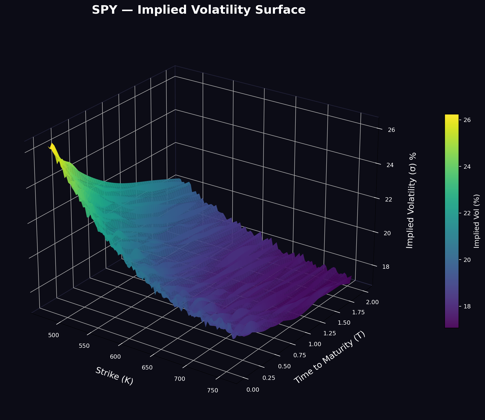
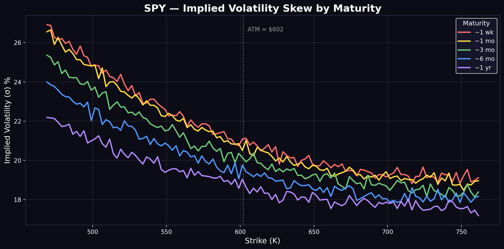

# Implied Volatility Surface Builder

[](https://python.org)
[](LICENSE)
[](https://github.com/psf/black)

End-to-end pipeline for constructing, calibrating, and visualizing implied volatility surfaces from equity option chains. Built for research, risk analysis, and portfolio-level vol monitoring.

<p align="center">
  
</p>

---

## Motivation

The Black-Scholes model assumes constant volatility, a convenient fiction that breaks immediately when you look at real option prices. Implied volatility varies across strikes (skew) and maturities (term structure), forming a surface that encodes the market's view on tail risk, jump risk, and hedging costs.

This project builds that surface from scratch:

1. Pull live option chains (or use synthetic calibration data)
2. Compute implied volatility by numerically inverting Black-Scholes
3. Clean and filter the raw IV grid (bid-ask noise, stale quotes, illiquid strikes)
4. Interpolate onto a smooth surface via cubic splines
5. Visualize in 2D (skew by maturity) and 3D (full surface)

The goal is **not** just pretty charts , it's a working analytical tool that reveals how the market prices crash insurance, how skew steepens in stress, and where Black-Scholes breaks down.

---

## What the skew actually tells you

<p align="center">
  
</p>

The 2D chart above shows implied volatility by strike for different maturities. A few things jump out:

- **Negative skew is persistent**: lower strikes (OTM puts) trade at higher IV than upper strikes (OTM calls). This is the market pricing crash insurance , the premium for unhedgeable jump risk that Black-Scholes assumes away.
- **Short-dated skew is steeper**: the ~1 week curve has the most dramatic slope. Gamma exposure is concentrated, and dealers need wider spreads to compensate.
- **Skew flattens with maturity**: the ~1 year curve is much smoother. Over longer horizons, the law of large numbers partially absorbs individual jump events.

This isn't academic , skew dynamics directly affect delta-hedging P&L, structured product pricing, and tail risk measurement in any portfolio context.

---

## Project structure

```
vol-surface-builder/
├── src/
│   ├── __init__.py
│   ├── black_scholes.py          # BS pricing, greeks, IV inversion
│   ├── data_feed.py              # option chain retrieval + cleaning
│   ├── surface_builder.py        # interpolation + surface construction
│   ├── visualization.py          # matplotlib + plotly charting
│   ├── svi_calibration.py        # SVI parametric fit (Gatheral)
│   └── config.py                 # constants, defaults, paths
├── notebooks/
│   └── vol_surface_analysis.ipynb
├── tests/
│   ├── conftest.py
│   ├── test_black_scholes.py
│   ├── test_surface_builder.py
│   └── test_svi.py
├── data/
│   └── sample_iv_data.csv
├── output/
│   ├── vol_surface_3d.png
│   ├── vol_skew_2d.png
│   ├── vol_surface_3d.html
│   └── vol_skew_2d.html
├── docs/
│   └── methodology.md
├── main.py
├── requirements.txt
├── setup.py
├── .gitignore
├── CHANGELOG.md
├── LICENSE
└── README.md
```

---

## Quick start

```bash
git clone https://github.com/Leotaby/vol-surface-builder.git
cd vol-surface-builder
pip install -r requirements.txt
python main.py
```

Output charts land in `output/`. Interactive HTML versions can be opened in any browser.

To use live market data instead of synthetic calibration:

```bash
python main.py --source live --ticker SPY
```

> **Note:** live data requires `yfinance` and an internet connection. The default mode uses SVI-calibrated synthetic data which runs offline and produces publication-quality results.

---

## Key modules

### `black_scholes.py`

Core pricing engine. Implements closed-form BS for European calls/puts, first-order greeks (delta, gamma, vega, theta, rho), and implied volatility inversion via Brent's method with robust bracketing. The IV solver handles edge cases: deep ITM/OTM, near-expiry, and zero-bid situations that cause naive solvers to diverge.

### `data_feed.py`

Handles option chain retrieval from `yfinance` (equities) with fallback to synthetic generation via SVI parameterization. Applies a cleaning pipeline: mid-price calculation, liquidity filters (OI + volume thresholds), moneyness bounds, and stale-quote detection. Returns a standardized DataFrame regardless of source.

### `surface_builder.py`

Takes cleaned (strike, maturity, IV) triples and constructs a smooth surface. Uses `scipy.interpolate.griddata` with cubic interpolation, falling back to nearest-neighbor at domain boundaries. Handles the messy reality of irregular option grids , strikes don't align across expiries, and some maturities have sparse coverage.

### `svi_calibration.py`

Implements the Stochastic Volatility Inspired (SVI) parameterization from Gatheral (2004). The SVI model fits total implied variance as a function of log-moneyness with five parameters: `a` (overall variance level), `b` (slope), `rho` (rotation/skew), `m` (translation), `sigma` (curvature). This project uses a simplified version for synthetic data generation that captures the essential features: negative skew, smile curvature at wings, and term structure flattening.

### `visualization.py`

Charting module with two backends: `matplotlib` for high-resolution static PNGs (dark theme, publication-ready) and `plotly` for interactive HTML with rotation/zoom. Both produce consistent styling , dark background, viridis colormap, properly labeled axes.

---

## Configuration

Edit `src/config.py` or pass CLI arguments:

| Parameter | Default | Description |
|-----------|---------|-------------|
| `TICKER` | `"SPY"` | Underlying symbol |
| `RISK_FREE_RATE` | `0.043` | Annualized risk-free rate |
| `MONEYNESS_BOUND` | `0.25` | Max abs(log-moneyness) to include |
| `MIN_OI` | `5` | Minimum open interest filter |
| `MIN_VOLUME` | `5` | Minimum daily volume filter |
| `N_EXPIRIES` | `8` | Number of expiries to pull (live mode) |
| `GRID_K_POINTS` | `100` | Strike-axis grid resolution |
| `GRID_T_POINTS` | `60` | Maturity-axis grid resolution |

---

## Technical notes

**Why Brent's method for IV?** Newton-Raphson is faster in theory but requires a good initial guess and can diverge for deep OTM options where vega is near zero. Brent's method is unconditionally convergent within a bracket , slower per iteration, but never fails. For a research tool where reliability matters more than microseconds, this is the right tradeoff.

**Why SVI for synthetic data?** The SVI parameterization is arbitrage-free (under parameter constraints) and captures the three main features of real vol surfaces: level, skew, and curvature. It's used extensively on equity index desks. The alternative , pulling live data , introduces noise, market-hours dependency, and reproducibility issues. SVI gives clean, realistic surfaces that are identical every time you run the code.

**Why not fit a full stochastic vol model?** Heston, SABR, and jump-diffusion models are more realistic but also more complex to calibrate. This project focuses on the **construction and visualization** of the vol surface, not on exotic model calibration. The `svi_calibration.py` module is intentionally kept simple so the pipeline is transparent. Extending to Heston or local vol is straightforward from this foundation.

---

## Extending this

Some natural next steps if you want to take this further:

- **SVI arbitrage constraints**: enforce no-butterfly and no-calendar spread arbitrage in the fitted surface (Gatheral & Jacquier, 2014)
- **Heston calibration**: fit the Heston stochastic vol model to the surface via characteristic function pricing + Levenberg-Marquardt
- **Greeks surface**: compute and plot delta, gamma, vega surfaces , useful for book-level risk decomposition
- **Real-time streaming**: replace batch pulls with websocket feeds from IBKR or Polygon for live surface updates
- **Skew analytics**: track 25-delta risk reversal and butterfly over time as regime indicators

---

## References

- Black, F. & Scholes, M. (1973). *The Pricing of Options and Corporate Liabilities*. Journal of Political Economy.
- Gatheral, J. (2004). *A Parsimonious Arbitrage-Free Implied Volatility Parameterization*. Global Derivatives & Risk Management.
- Merton, R. C. (1976). *Option pricing when underlying stock returns are discontinuous*. Journal of Financial Economics.
- Dupire, B. (1994). *Pricing with a Smile*. Risk Magazine.

---

## License

MIT , see [LICENSE](LICENSE).
